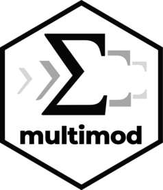

<!-- README.md is generated from README.Rmd. Please edit that file -->

```{r, include = FALSE}
knitr::opts_chunk$set(
  collapse = TRUE,
  comment = "#>",
  fig.path = "man/figures/README-",
  out.width = "100%"
)
```

# multimod 

<!-- badges: start -->
<!-- badges: end -->

The `multimod` R package defines a domain-specific language (DSL) and internal representation for mathematical programming models. It enables parsing, manipulation, and export of equations and constraints across multiple modeling languages including GAMS, Pyomo, JuMP, and LaTeX.

## Installation

``` r
# install.packages("pak")
pak::pak("optimal2050/multimod")
```

## Core Features

- Parse GAMS-style equations into symbolic tree structure
- Represent variables, parameters, and mappings as structured R objects
- Render equations to multiple target formats: GAMS, Pyomo, JuMP, LaTeX
- Visualize equations as graphs (visNetwork or DiagrammeR)

## Workflow Diagram
Items in curly braces `{}` are planned for implementation, 
double curly braces `{{}}` are potential extensions.

```text
[ GAMS / {JuMP / Pyomo / GMPL} ]
              ↓
          read_gams()
         {read_jump()}
         {read_pyomo()}
         {read_gmpl()}
           {{...}}
              ↓
     ┌────────────────────┐
     │  model_structure   │
     │ (a named list ...) │
     └────────────────────┘
              ↓
        as_multimod()
              ↓
   ┌────────────────────────┐
   │    Core Structures     │      as_visNetwork() 
   │    <ast>, <multimod>   │     {as_diagrammer()} 
   │ (sets, parameters,     │ ⟷  {{symbolsic manipulation}}  
   │  variables, equations, │     {fold_parameters(), ...}
   │  mappings, ...)        │     {data exchange formats}
   └────────────────────────┘
              ↓
     ┌────────────────────┐
     │ Rendering / Output │
     └────────────────────┘
              ↓
   → write_latex()
   → write_gams()
   → {write_jump()}
   → {write_pyomo()}
   → {write_gmpl()}
   → {{write_ampl()}}
   → {{write_mps()}}
   → {{write_cplex()}}
   → {{write_gurobi()}}
   → {...}

```

## Example Workflow

```r
# Load a GAMS file and parse
model_info <- read_gams("my_model.gms")
class(model_info) # "model_structure"

mod <- as_multimod(model_info, name = "My model in multimod format")
class(mod) # "multimod" "ast"

# Render a specific equation to Julia/JuMP
{as_jump(mod$equations[["eqObjective"]])}

# Visualize equation tree
library(visNetwork)
as_visNetwork(mod$equations$eqObjective)

# Convert to LaTeX
as_latex(mod$equations$eqObjective) |> cat()

# Write the entire model to LaTeX
write_latex(mod, 
            file = "my_multimod_model.tex",
            title = "My multimod model equations",
            subtitle = "Generated by multimod package")
tinytex::pdflatex("my_multimod_model.tex")

# Save to GAMS
write_gams(mod, file = "my_multimod_model.gms")

```

## License

MIT License

## Development Status
The package is under active development. Contributions, bug reports, and feature requests are welcome! See details in [devstatus](...).


