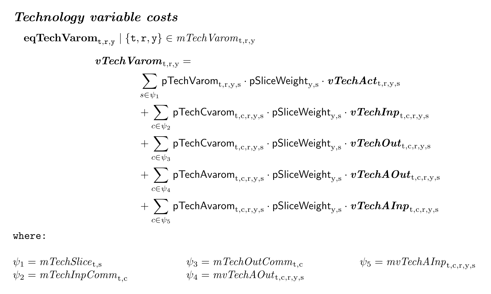
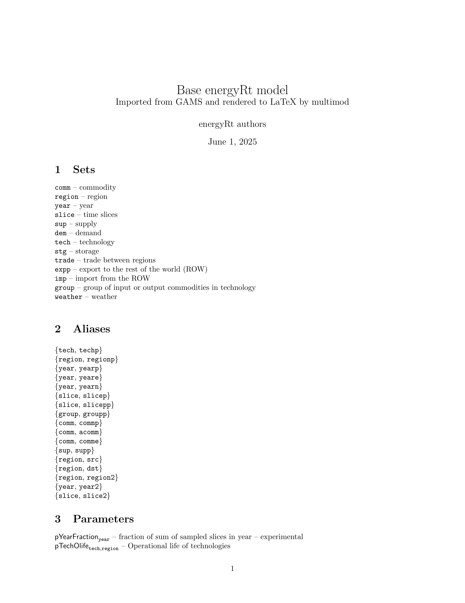

```{r, include = FALSE, message = FALSE, warning = FALSE, eval=TRUE}
knitr::opts_chunk$set(
  collapse = TRUE,
  comment = "#>",
  eval = TRUE
)
library(here)
```

This vignette provides an overview of the current functionality of the `multimod` package, which is designed to parse GAMS models and convert them into a structured format for further analysis, visualization, rendering to LaTeX, and other mathematical programming languages. 

## Installation  
The development version of the package is available for installation from GitHub using the `pak` package. The package is not yet available on CRAN.
```{r, eval=FALSE}
# install.packages("pak")
pak::pkg_install("optimal2050/multimod", dependencies = TRUE)
```

## Setup
```{r setup}
library(lobstr)
library(visNetwork, quietly = TRUE)
library(multimod)
```

## Example model

Download example model  
```{r, eval=FALSE}
gams_source <- file.path(tempdir(), "energyRt.gms")

# Download "energyRt.gms" GAMS model source file from GitHub
download.file(
  url = file.path("https://raw.githubusercontent.com/optimal2050/energyRt",
                  "refs/heads/master/gams/energyRt.gms"),
  destfile = gams_source,
  method = "curl"
)

file.exists(gams_source)
```

```{r, echo=FALSE, eval=TRUE, iclude=FALSE}
gams_source <- here("tmp/energyRt.gms") |> fs::path_rel(start = getwd())
```

## Parse model structure
Model structure is a named list of the model symbols: sets, parameters, variables, equations, and other components. The parser reads declarations to further identify the model elements used in equations/constraints. Data and operations on data are not imported--the parser focuses on the model structure, which is stored in an object of class `model_structure`.

```{r, eval=TRUE}
mod_str <- read_gams(gams_source, include = FALSE, verbose = FALSE)
print(mod_str)
```

## Convert to multimod
The `model_structure` object can be converted to a `multimod`, either equation by equation or all at once. The multimod's `model` class is a structured representation of the model using the Abstract Syntax Tree (AST) format. Every element of a model, including operators, variables, sets and parameters, is represented as an AST node. 
```{r, eval=TRUE}
# (Optional) Collect all symbols
symbols <- build_symbols_list(mod_str)
# analyze an equation
ast_node <- parse_gams_equation(mod_str$equations[["eqObjective"]], symbols)
ast_node
```

### Abstract Syntax Tree (AST)
AST nodes are the building blocks of multimod equations, creating a nested structures.
```{r, eval=TRUE}
lobstr::tree(ast_node, max_length = 25, max_depth = 5)
```

### Visualization
They can be visualized as a tree structure, which is useful for understanding the relationships between different elements in the model.
```{r, eval=TRUE}
as_visNetwork(ast_node)
```

## Convert to multimod `model` object
The `as_multimod` method applied converts the entire model into a multimod object, which contains lists of sets, parameters, variables, equations, represented via AST nodes.
```{r, eval=TRUE}
mod <- as_multimod(mod_str)
print(mod)
```

Equations are stored in `$equations` list, and can be accessed by their names. Each equation is an object of class `equation`, which contains the left-hand side (LHS) and right-hand side (RHS) expressions and relation operator.

```{r, eval=TRUE}
eq <- mod$equations$eqTechCap
print(eq)
as_visNetwork(eq)
```


## LaTeX rendering  
The `as_latex` function converts the multimod equation or AST node into LaTeX format. The LaTeX output is a string that can be printed or saved to a file.
```{r, eval=TRUE}
eq$lhs # LHS of the equation - a variable
```

Convert to character
```{r, eval=TRUE}
as.character(eq$lhs)
```

Convert to LaTeX string
```{r, eval=TRUE}
as_latex(eq$lhs) |> cat()
```

Render the entire equation
```{r, eval=TRUE}
as_latex(eq) |> cat()
```

Saving an equation to a tex file can be done using the `write_latex` method. This method can be applied to the entire multimod object, or to a specific equation.
```{r, eval=FALSE}
eq <- mod$equations$eqTechCapUp
eq_tex_file <- paste0("tmp/", eq$name, ".tex")
write_latex(eq, file = eq_tex_file)
tinytex::pdflatex(eq_tex_file)
```

The `as_latex` and `write_latex` methods for equations are aiming for formatting the latex output to fit the equation to the page width and improve readability. Long equations are broken into multiple lines, and long conditional expressions are remapped with AST `where` class and display the replacement under the equation under `where` header.
```{r, eval=FALSE}
eq <- mod$equations$eqTechVarom
eq_tex_file <- paste0("tmp/", eq$name, ".tex")
write_latex(eq, file = eq_tex_file)
tinytex::pdflatex(eq_tex_file)
```

```{r, eval=FALSE, echo=FALSE, include=FALSE}
# Use to reproduce the png file
pdf_file <- sub("\\.tex$", ".pdf", eq_tex_file)
png_file <- sub("\\.tex$", ".png", eq_tex_file)
img <- image_read_pdf(pdf_file, density = 300)
image_write(img, png_file)
# edit further to reduce size if needed 
# and save as "eqTechVarom-full-names.png"
```

```{r, eval=TRUE, echo=FALSE}
knitr::include_graphics("images/eqTechVarom-full-names.png")
```

### Replacing long names with aliases
There is also an option to replace long names of any simbols with shorter aliases by using `alias_map` argument in `as_latex` or `write_latex` methods. The aliases are defined as a named list, where the names are the original symbols and the values are the shorter aliases.
```{r, eval=FALSE}
# Example of using aliases in LaTeX rendering
alias_map <- list(
  region = "r", 
  comm = "c", 
  commp = "cp", 
  tech = "t", 
  year = "y", 
  slice = "s"
)
# eq <- mod$equations$eqTechVarom # the same equation as above
eq_tex_file <- paste0("tmp/", eq$name, "_short.tex")
write_latex(eq, file = eq_tex_file, alias_map = alias_map)
tinytex::pdflatex(eq_tex_file)
```

```{r, eval=FALSE, echo=FALSE}
# Use to reproduce the png file
pdf_file <- sub("\\.tex$", ".pdf", eq_tex_file)
png_file <- sub("\\.tex$", ".png", eq_tex_file)
img <- image_read_pdf(pdf_file, density = 300)
image_write(img, png_file)
# edit further to reduce size if needed
# and save as "eqTechVarom-short-names.png"
```

```{r, eval=TRUE, echo=FALSE}

```

### Render full model to LaTeX
The `write_latex` method can be applied to the multimod `model` object to export the entire model to LaTeX format. This will create a LaTeX file with all equations, sets, aliases, parameters, and variables.
```{r, eval=FALSE}
write_latex(mod, file = "tmp/example_model.tex", 
            title = "Base energyRt model",
            subtitle = "Imported from GAMS and rendered to LaTeX by multimod",
            author = "energyRt authors",
            alias_map = multimod::example_model$short_aliases)
tinytex::pdflatex("tmp/example_model.tex")
```

```{r, eval=FALSE, include=FALSE, echo=FALSE}
library(tikzDevice)
library(magick)
library(knitr)
img <- image_read_pdf("tmp/example_model.pdf", density = 300)
image_write(img, here("vignettes", "images", "example_model.png"))
```

```{r, eval=TRUE, echo=FALSE}

```

## Rendering back to GAMS 
The idea of the `multimod` package is to provide a way to convert the model structure back to GAMS, Julia/JuMP, Python/Pyomo, or other mathematical programming languages. The current version has a drafted implementation of the `as_gams` method, which converts the multimod object back to GAMS code. This feature does not create a fully functional GAMS model yet, it exports declarations only. Connections with data is planned for future releases.
```{r, eval=TRUE}
as_gams(mod$equations$eqTechCapUp) |> cat()
```
Render full model.
```{r, eval=FALSE}
write_gams(mod, file = "tmp/example_model.gms")
```

## Summary
This vignette provides an overview of the current functionality of the `multimod` package, which allows for parsing certain GAMS models, converting them into a structured format, rendering to LaTeX, and converting back to GAMS code. The package is still under development, not all styles of GAMS models and syntax are supported, more features will be added in the future. See the [{dev-status}](roadmap.html) article for details.
